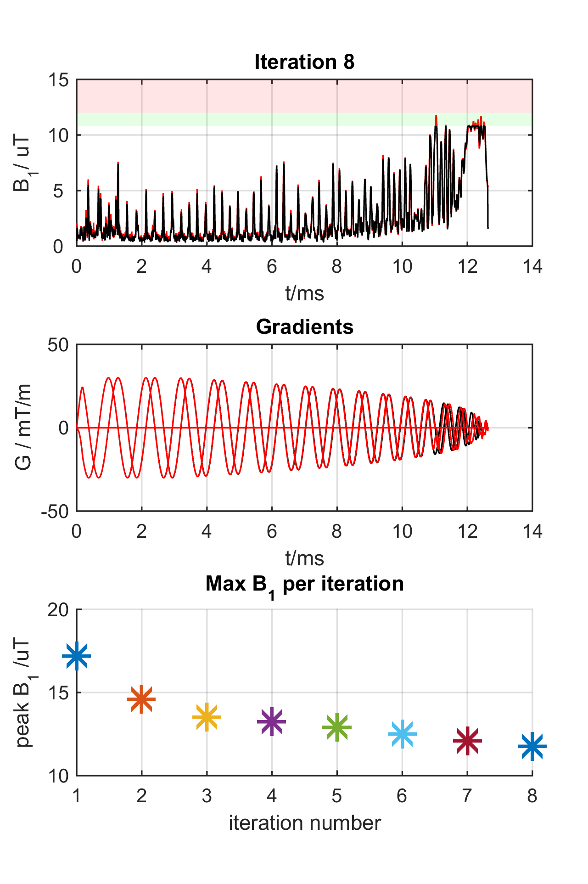

# reVERSE-GIRF
**VERSE guided RF pulse design with modification for imperfect gradient performance**

This repository contains

*  Matlab code for time-optimal gradient design [(Lustig et al, 2008)](http://doi.org/10.1109/TMI.2008.922699). The `minTimeGradient` code is also available  [from its author](http://www.eecs.berkeley.edu/~mlustig/Software.html) who has given permission for inclusion within this package. Please cite appropriately

  *Note that only the Matlab code necessary for our implementation is included. Please visit [Lustig's site](http://www.eecs.berkeley.edu/~mlustig/Software.html) for a full version including MEX and C*

* An implementation of 'time-optimal' VERSE pulse design  [(Lee et al, 2009)](http://doi.org/10.1002/mrm.21950). This is based on `minTimeGradient`

* An implementation of the 're-VERSE' iterative method [(Lee et al, 2012)](http://doi.org/10.1002/mrm.23010)

* An updated version of re-VERSE that takes account of gradient imperfections using measured gradient impulse response functions (GIRFs).

* Example GIRF data measured on 3T and 7T Philips MRI systems

Author: Shaihan Malik, July 2015

### [Releases](https://github.com/mriphysics/phase_relaxed_CPMG_excitation/releases)
Code is available as a release including binary files (Matlab .mat files) containing B1 and B0 field maps and GIRF data. Please see the releases page for more.

Release 1.0 of this code is citeable: 

### Usage
Run through script `spiral2d_example_script.m`: this takes the user through an example 2D spiral excitation with and without including the GIRF. Scripts rely on B1 and B0 maps and GIRF data available on the releases page.

The `reVERSE_GIRF` function iteratively reduces the peak B1 of the RF pulse by dilating the gradients and correcting for distortion summarized by the GIRF. Below is an example of the display produced when parameter 'show' is selected.

The top row shows the B1 of the RF pulse (maximum across all channels in case of PTx). The black RF pulse trace represents the result of VERSE based pulse design on the most recent iteration (it limits B1 below the design limit (green box) as required). The red trace shows the RF pulse amplitude after re-design of the pulse to account for B0 effects. The algorithm will terminate if the red trace is below the shaded red box representing the maximum allowed B1. See [(Lee et al, 2012)](http://doi.org/10.1002/mrm.23010) for an explanation of these two separate limits.

The middle row shows gradients (black=starting;red=current iteration). The bottom row shows how the maximum B1 changes through the iterations.

### Dependencies
The code is dependent on [lsqrSOL](https://github.com/areslp/matlab/tree/master/lsqrSOL) for solving the a linear non-square matrix problem. This can be substituted for another method if desired.

All code is provided freely under the terms of the MIT license. Please cite appropriately.
